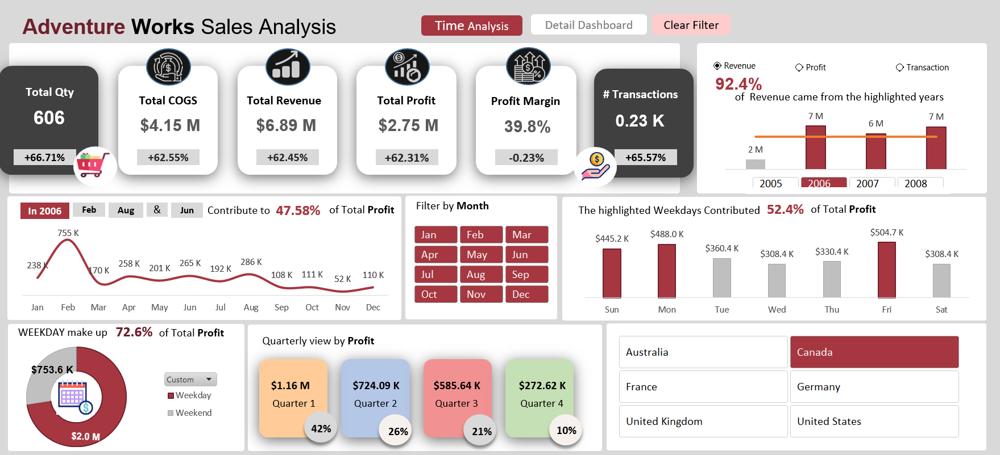
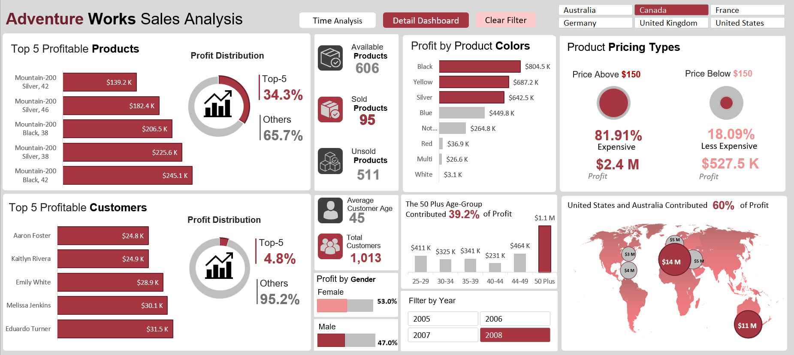

# 📊 Adventure Works Sales Analysis

A comprehensive Excel-based analytics solution for tracking sales performance, customer behavior, and product insights. Built dynamic dashboards with advanced Excel formulas and pivot tables to enable real-time KPI monitoring and data-driven decision making.


## 🎯 Project Overview

This project analyzes the Adventure Works dataset to uncover sales trends, customer behavior patterns, and product performance metrics. The solution provides actionable insights through interactive dashboards that support strategic business decisions.

## ✨ Key Features

- **Dynamic Dashboards**: Interactive visualizations with pivot tables, slicers, and drill-down capabilities
- **Automated Reporting**: Streamlined ETL processes and data automation reducing manual reporting time by 25%
- **Real-time KPI Tracking**: Live performance monitoring across sales, customers, and products
- **Clean Data Pipeline**: Implemented robust data cleaning and validation processes
- **Advanced Analytics**: Complex formulas and calculations for trend analysis and forecasting

## 🛠️ Tools & Technologies

- **Microsoft Excel**: Primary analysis and visualization tool
- **Power Query**: Data transformation and ETL automation
- **Pivot Tables & Slicers**: Interactive data exploration
- **Advanced Formulas**: VLOOKUP, INDEX-MATCH, SUMIFS, conditional formatting
- **Data Validation**: Ensuring data quality and consistency

## 📈 Key Insights & Impact

- ✅ Reduced reporting time by **25%** through automation
- ✅ Enabled real-time performance tracking for sales teams
- ✅ Improved cross-departmental visibility into sales metrics
- ✅ Streamlined data cleaning and ETL processes
- ✅ Supported strategic decision-making with clear, actionable visualizations

## 📊 Dashboard Components

### Sales Performance Dashboard
- Revenue trends by month, quarter, and year
- Top-performing products and categories
- Regional sales distribution
- Year-over-year growth analysis

### Customer Behavior Dashboard
- Customer segmentation and demographics
- Purchase patterns and frequency
- Customer lifetime value analysis
- Retention and churn metrics

### Product Analysis Dashboard
- Product performance by category
- Inventory and stock level tracking
- Profitability analysis
- Product recommendation insights

## 🚀 Features Implemented

1. **Data Cleaning & Preprocessing**
   - Removed duplicates and handled missing values
   - Standardized data formats across multiple sheets
   - Implemented data validation rules

2. **Automated ETL Pipeline**
   - Power Query for data extraction and transformation
   - Automated refresh for real-time updates
   - Reduced manual data entry effort

3. **Interactive Visualizations**
   - Dynamic pivot tables with multiple dimensions
   - Slicers for filtering by date, region, product
   - Conditional formatting for quick insights
   - Charts and graphs for trend visualization

4. **KPI Monitoring**
   - Revenue, profit margin, and growth rate tracking
   - Customer acquisition and retention metrics
   - Product performance indicators
   - Regional sales targets vs. actuals

## 💡 Business Value

This analytics solution empowers teams to:
- Make data-driven decisions quickly
- Identify sales opportunities and trends
- Monitor performance against targets in real-time
- Optimize product mix and inventory
- Improve customer targeting strategies

## 📂 Project Files
```
Adventure-Works-Sales-Analysis/
│
├── Adventure Works.xlsm                   # Main dashboard and analysis file
├── Dashboard_functionality_video.mp4      # Dashboard interactive video
├── Dataset_AdventureWorks.xlsx            # Original source data
├── Final_Dashboards.pdf                   # Dashboards
└── README.md                              # Project documentation
```


## 🎓 Skills Demonstrated

- Advanced Excel proficiency
- Data cleaning and preprocessing
- ETL automation with Power Query
- Dashboard design and data visualization
- Business intelligence and KPI development
- Data storytelling and insight generation

## 📸 Screenshots

### Executive Dashboard


### Product and Customer Analysis



## 🚀 How to Use

1. Download both Excel files from this repository
2. Open `Adventure Works.xlsm` to view the dashboards
3. Use slicers and filters to explore different dimensions
4. Refer to `AdventureWorks Raw Data.xlsx` for the source data

## 🔗 Connect With Me

- **LinkedIn**: [komal-sukheja](https://www.linkedin.com/in/komal-sukheja/)
- **Email**: komalsukheja2001@gmail.com
- **GitHub**: [komal-sukheja](https://github.com/komal-sukheja)

---

⭐ If you found this project helpful, please consider giving it a star!
